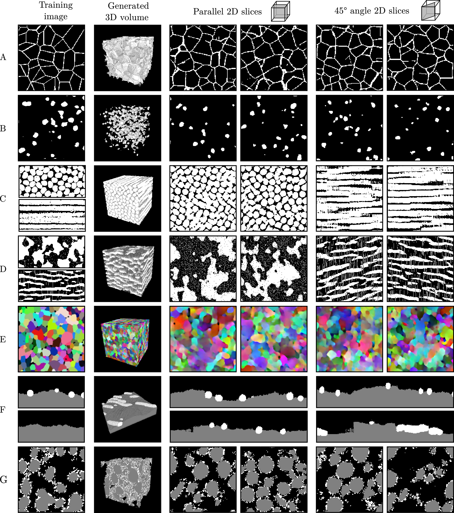

# SliceGAN 

### Installation

To set up a virtual environment and install the required dependencies, follow these steps:

1. **Create a virtual environment**:
    ```bash
    python3 -m venv slicegan-env
    ```

2. **Activate the virtual environment**:
    - On Windows:
        ```bash
        slicegan-env\Scripts\activate
        ```
    - On macOS and Linux:
        ```bash
        source slicegan-env/bin/activate
        ```

3. **Install the required packages**:
    ```bash
    pip install -r requirements.txt
    ```

Make sure to activate the virtual environment every time you work on the project to ensure that you are using the correct dependencies.


To use SliceGAN open run_slicegan and edit information as requested. SliceGAN requires a single 2D training image of an isotropic microstructure, or three 2D images taken at perpendicular angles of an anisotropic microstructure. Images can be colour, grayscale or n-phase.

Use 'python run_slicegan 1' to train a new generator or 'python run_slicegan 0' to generate and save an example .tif file

### Development

If you are interested in trying new architectures, see the networks.py file

To adjust the training parameters or algorithm, see train.py

To add a new preprocessing method e.g for a different training datatype, see preproccessing.py.

### Results



### Versions

